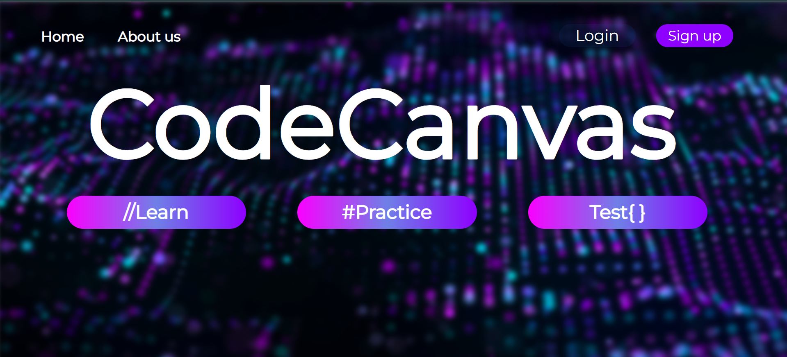
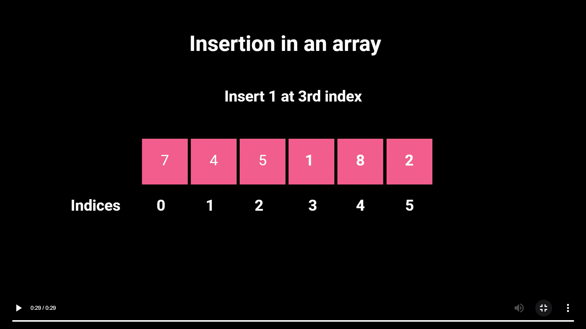
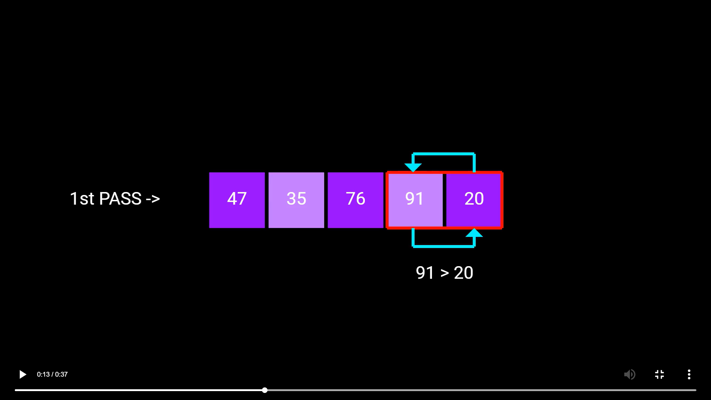
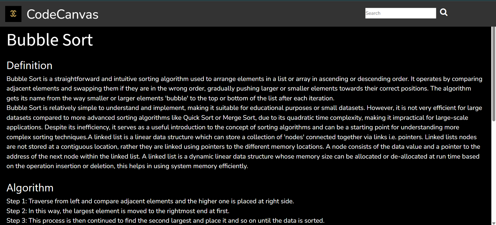
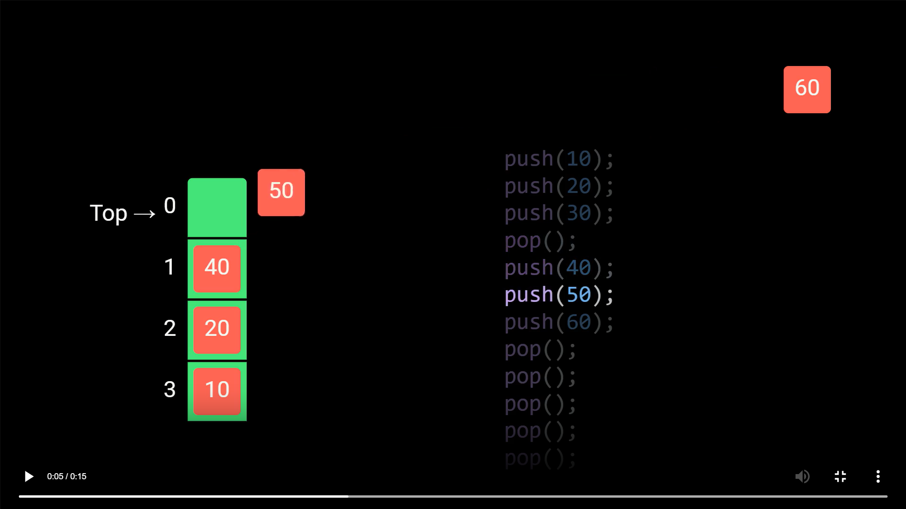
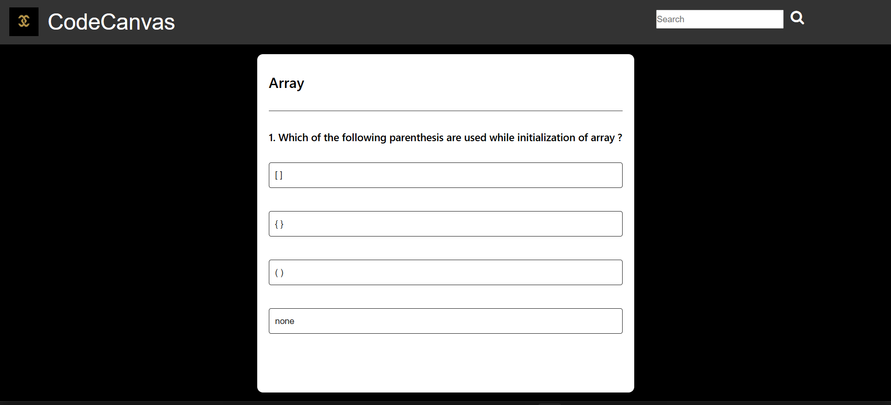

# 📚 DSA Animation Learning Platform

An interactive platform to learn **Data Structures & Algorithms** using real-time **animations** created with **Motion Canvas**.  
The project is built using **Node.js, Express, EJS, CSS, and JavaScript**, providing a smooth and lightweight learning experience.

---

## 🚀 Features

### 🎞️ Animated Visualizations  
- Step-by-step animations for DSA concepts  
- Built using **Motion Canvas**  
- Helps beginners understand internal working of algorithms

### 📖 Concepts Covered  
- Arrays  
- Linked Lists  
- Stacks & Queues  
- Trees (Binary Tree, BST)  
- Sorting and Searching Techniques  
- Graphs and many more animations coming soon…

### 🎯 Clean & Simple UI  
- EJS templates for server-side rendering  
- Responsive CSS layout  
- Beginner-friendly navigation

### ⚙️ Tech Stack  
| Technology | Purpose |
|-----------|---------|
| **Node.js** | Server-side runtime |
| **Express.js** | Backend framework |
| **EJS** | Templating engine |
| **CSS** | Styling |
| **JavaScript** | Frontend logic |
| **Motion Canvas** | Core animation engine |

---

## 🖼️ Screenshots
```md
## 📸 Screenshots

### 🏠 Landing Page


### 📚 Array Animation


### 🔁 Bubble Sort Animation


### 🔍 Bubble Sort Description


### 🧱 Stack Animation


### 🎯 Quiz Page



